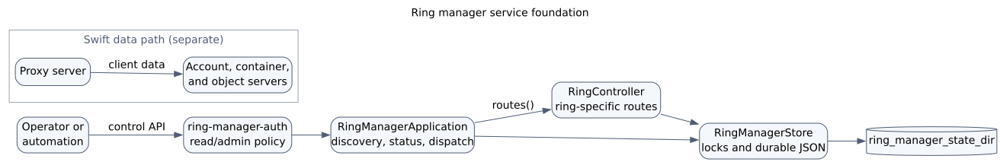

==========================
Ring Manager Control Plane
==========================

Ring manager is an optional Swift-style WSGI control-plane service.
It gives ring operations a dedicated process and API boundary without placing
ring management in the Object Storage v1 API or the client data path.

The service framework provides:

* unversioned service discovery at ``/``;
* versioned API discovery at ``/api/v1/``;
* service status at ``/api/v1/ring_manager/status/``;
* ring metadata and builder-backed device management at
  ``/api/v1/rings/``;
* persistent ring build jobs and a separate publication worker;
* immutable release and builder downloads with conditional and range support;
* separate read and administrator authentication keys;
* directory-backed JSON state with locked, atomic, durable writes; and
* normal Swift process management through ``swift-init``.

Ring-specific resources are owned by an internal controller.
This keeps HTTP dispatch and process lifecycle in the WSGI application while
allowing each ring capability to add its routes and state together.

Architecture
============

An operator or automation client sends a control-plane request to the
ring-manager port.
The authentication middleware classifies the request as a read or an
administrator operation before it reaches the application.
The WSGI application owns discovery, status, method negotiation, error
mapping, and request logging.
Ring-specific routes are delegated through ``RingController.routes()``.
``RingBuilderManager`` performs locked updates to Swift builder files for the
controller.
Durable service state is stored below ``ring_manager_state_dir``.
Builder-owned topology remains in Swift builder files below
``ring_builder_dir``.
Immutable release artefacts remain below ``ring_artifact_dir``.

The proxy, account, container, and object services continue to use installed
Swift ring files in the normal data path.
Client object requests do not pass through ring manager.

Request and error boundary
==========================

The public API is rooted at ``/api/v1/``.
The unversioned root is discovery only and advertises the supported API
version.
GET routes also accept HEAD, and every matched route accepts OPTIONS and
returns an ``Allow`` header.

Expected request errors use normal HTTP responses.
Unexpected exceptions are logged by the service and returned as a generic
JSON ``500 Internal Server Error`` response.
Tracebacks and internal exception text are not exposed to clients.

Authentication
==============

The ``ring-manager-auth`` Paste filter accepts two credential classes:

* ``admin_key`` authorises every request; and
* ``read_key`` authorises ordinary GET and HEAD requests only, except for
  paths reserved for builder downloads.

Keys may be supplied inline or through ``admin_key_file`` and
``read_key_file``.
The two forms for one credential are mutually exclusive.
Secret files are opened without following symlinks, must be regular files
owned by root or the effective service user, and must not grant group or other
permissions.
Secrets are loaded once when the middleware starts.

If no suitable key is configured, the middleware returns ``503 Service
Unavailable`` rather than allowing the request.
An incorrect key returns ``401 Unauthorized``.
OPTIONS and ``/healthcheck`` bypass authentication so middleware negotiation
and service monitoring remain available.

State storage
=============

``ring_manager_state_dir`` defaults to
``/etc/swift/ring-manager-state``.
State is stored as independent JSON resources rather than one large document.
Identifiers are percent-encoded before they are used as file names.

State mutations use a lock where a shared index is involved.
Each JSON write creates a unique temporary file in the destination directory,
flushes and fsyncs its content, atomically renames it into place, and fsyncs
the directory.
New directory parents and deletes are fsynced as well.
This keeps prior state intact when a write fails before the rename and makes
completed updates durable across a host crash.

Immutable downloads
===================

Release metadata is stored as one manifest per release below ``ring_manager_state_dir/releases``.
Public release and manifest responses remove local paths and expose concrete file URLs below ``/api/v1/rings/releases/``.
Artefact file paths are resolved beneath ``ring_artifact_dir`` using real paths so ``..`` components and symbolic links cannot escape the configured root.

Ring artefacts stream from disk and support HEAD, conditional requests, and byte ranges.
The MD5 digest is used as the HTTP ETag for compatibility with Swift clients, while SHA-256 remains available in ``X-Checksum-Sha256`` as the stronger integrity value.

Builder metadata and builder-file downloads require the administrator credential.
The service verifies that a builder resolves below ``ring_builder_dir`` and streams a private snapshot so an in-progress response is stable across concurrent builder replacement.
The temporary snapshot is removed when the response closes.

Publication
===========

``POST /api/v1/rings/releases/`` creates a persistent build job and returns
quickly with its status URL.
The request either rebuilds all enabled rings or uses ``rings`` as its rebuild
set.
Unchanged enabled rings are carried forward from their latest immutable
per-ring artifacts, so every release manifest remains a complete cluster
snapshot.
Disabled rings remain editable but are omitted from releases and cannot be
selected for publication.
``POST /api/v1/rings/<ring_id>/versions/`` also creates a persistent job.
The builder worker builds one artifact without creating a cluster release or
changing the latest release pointer.
Ring-manager automatically writes ring v2 when a builder needs device IDs wider
than the legacy 2-byte format.
An explicit v1 request fails instead of writing a lossy artifact.
Release workers lock every selected builder in deterministic path order through
format preflight, rebalance, and artifact writes.
This permits controlled testing of disabled rings.
Jobs are assigned a durable monotonic sequence and are claimed by
``swift-ring-manager-builder``.
The queue preserves FIFO ordering for overlapping ring scopes.
A build blocked by ``min_part_hours`` is recorded as deferred until it can
make a useful ring change instead of publishing a no-op artifact.
Operators may cancel only queued or deferred jobs.
Cancellation records immutable terminal history and never interrupts an active
rebalance or publication attempt.
Failed and cancelled jobs may be retried as fresh FIFO jobs with queryable
``retry_of`` and ``retry_root`` lineage.

Ring resources and builder authority
====================================

A ring resource combines small logical metadata with a live view of its Swift
builder.
Logical metadata such as the ring name, cluster reference, policy type, and
storage policy index is stored as JSON below ``ring_manager_state_dir``.
Devices, weights, regions, zones, ports, partition power, replica count,
``min_part_hours``, overload, and builder version remain authoritative in the
builder file.
They are not copied into the JSON resource.

The API derives standard builder names for account, container, and object
rings, or accepts one explicit ``builder_files`` entry on a ring.
A ring response hydrates builder-owned fields from the current builder file.
This means a builder changed by established Swift tooling is reflected in the
next ring-manager read.

Creating a ring with builder settings creates its builder file under an
exclusive lock.
PATCH may change the replica count, ``min_part_hours``, and overload through
Swift's ``RingBuilder`` methods.
Ordinary PUT or PATCH cannot change partition power on an existing builder.
Object-ring partition power instead uses explicit prepare, increase, cancel,
and finish actions under the same builder lock.
Ring reads report the builder's lifecycle state and valid next actions.
Prepare and increase reject an overlapping active build, while cancel and
finish stay available for recovery.
Every action changes builder state only and requires a later rebalance and
publication workflow.
Device add, replace, and remove requests validate the complete input before
saving a new durable builder file.
These operations change desired builder state only: they do not rebalance the
ring or publish a ``.ring.gz`` file.

Device topology validation accepts IPv4, IPv6, and structured host names.
Regions, zones, device IDs, and ports use guarded ASCII-decimal parsing;
weights and builder numeric settings must be finite and within their allowed
ranges.
Explicit device IDs are bounded because ``RingBuilder.devs`` is a dense list.
They may exceed the legacy 2-byte ring-format range, which selects ring v2 at
publication time.
Invalid multi-device requests leave the existing builder unchanged.
Builder saves use a unique temporary file, fsync the file, atomically rename
it, preserve an existing file mode, and fsync the parent directory.

Read-only analysis endpoints expose assigned parts, rebalance readiness,
dispersion, and partition risk directly from current builder files.
The bulk partition-risk endpoint accepts node, replication, and device
selectors through GET query strings or a bounded POST body.
Selector limits are checked before builders are loaded, detailed partition
lists are opt-in, and multiple builders keep separate device namespaces.
The analysis does not mutate, rebalance, or publish a builder.

Operations
==========

Ring manager is registered as the ``ring-manager-server`` Swift service.
It belongs to both the ``all`` and ``control`` groups and supports graceful
and seamless reloads like other WSGI services.
It is not a background daemon and is excluded from ``swift-init ... once``.

Common commands are::

    swift-init ring-manager-server start
    swift-init ring-manager-server status
    swift-init ring-manager-server reload
    swift-init control status

The SAIO seed is
``doc/saio/swift/ring-manager-server.conf``.
The SAIO reset helper removes the ring-manager state directory so a full reset
does not retain control-plane state from the previous environment.

Configuration and API references
================================

See :doc:`config/ring_server` for the server and authentication options.
See :doc:`api/ring_manager` for ring resources, device operations, and
response conventions.
The ``swift-ring-manager`` CLI provides status, ring and device management,
publication, release downloads, partition-power lifecycle actions, and
read-only analysis over the same API.
Its device commands accept ``swift-ring-builder`` shorthand or the inventory
shape in ``etc/ring-manager-devices.yaml-sample``.
